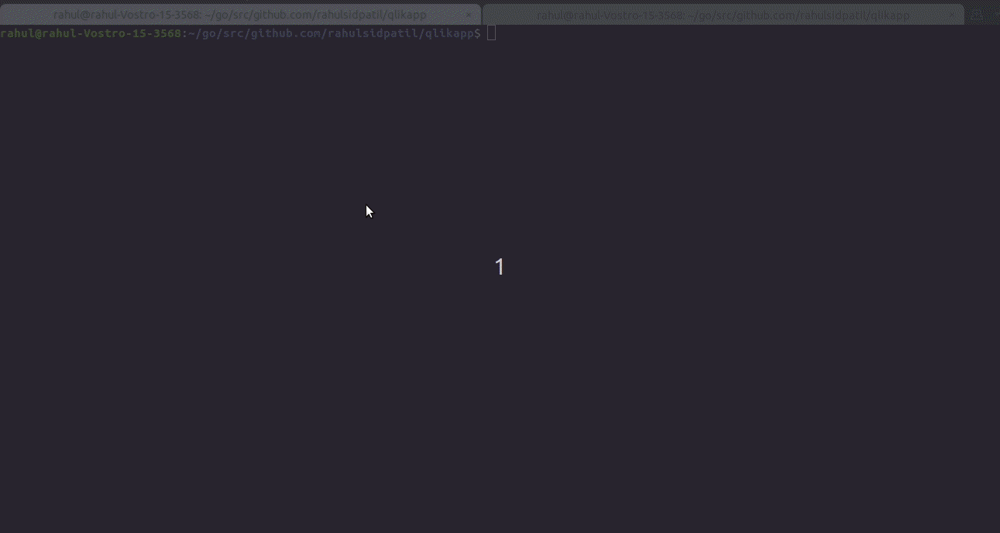

# qlikapp: sample message server for QlikAudition
The application is a simple REST API server that will provide endpoints to allow creating, accessing and manipulating ‘messages’. The application also provides an endpoint to observe `application's runtime profiling data`

# Getting started
Following are the steps to run this application in local docker environment

## Prerequisites
- git (recommended version version 2.17.1)
- Go (recommended version version go1.13.10)
- docker (recommended version 19.03.12). 
Installation steps available at: https://docs.docker.com/engine/install/ubuntu/ https://docs.docker.com/engine/install/linux-postinstall/
Make sure to be able to run `docker as non root user` 
- docker-compose version (recommended version 1.26.2)
Installation steps available at: https://docs.docker.com/compose/install/ https://docs.docker.com/engine/security/rootless/
Make sure to be able to run `docker-compose as non root user`

## Building, Running and Accessing the application:
1) Clone the qlikapp repository to your $(GOPATH) e.g. `~/go/src/github.com/rahulsidpatil`
```
git clone git@github.com:rahulsidpatil/qlikapp.git
```
2) cd to qlikapp dir
```
cd qlikapp
```
3) To build and run qlikapp; use follwoing command
```
make docker-deploy-up
```
It will a take a while to build and deploy the application on your local docker environment.
Once the deployment is successfull; the console will display application access urls as:
```
echo "Server started at url: http://localhost:8080"
Server started at url: http://localhost:8080
echo "The API documentation is available at url: http://localhost:8080/swagger/"
The API documentation is available at url: http://localhost:8080/swagger/
echo "Server runtime profiling data available at url: http://localhost:8080/debug/pprof"
Server runtime profiling data available at url: http://localhost:8080/debug/pprof

```
4) To stop qlikapp; use following command:
```
make docker-deploy-down
```

## qlikapp in action:
1) Build n Run qlikapp:


2) Use qlikapp:


3) Check api stats:


# Overview of code structure:
Following is the qlikapp directory structure. Each dir consists of a README.md which has detailed description of respective packages.
```
.
├── api
│   ├── docs
│   │   ├── docs.go
│   │   ├── swagger.json
│   │   └── swagger.yaml
│   └── README.md
├── build
│   ├── db
│   │   └── mysql
│   │       ├── Dockerfile
│   │       └── scripts
│   │           ├── createDB.sql
│   │           └── initData.sql
│   ├── docker-deploy
│   │   └── docker-deploy.yaml
│   ├── k8s-deploy
│   │   └── qlikapp.yaml
│   └── README.md
├── buildnRunQlikapp.gif
├── cmd
│   ├── main.go
│   └── README.md
├── Dockerfile
├── go.mod
├── go.sum
├── LICENSE
├── Makefile
├── pkg
│   ├── dal
│   │   ├── dalintf.go
│   │   ├── entities.go
│   │   └── mysql.go
│   ├── handlers
│   │   └── app.go
│   ├── README.md
│   └── util
│       ├── httpErrorUtil.go
│       └── utils.go
├── qlikapp-apiStats.gif
├── README.md
└── use-qlikapp.gif

```

# Licensing
qlikapp is under the MIT License.
